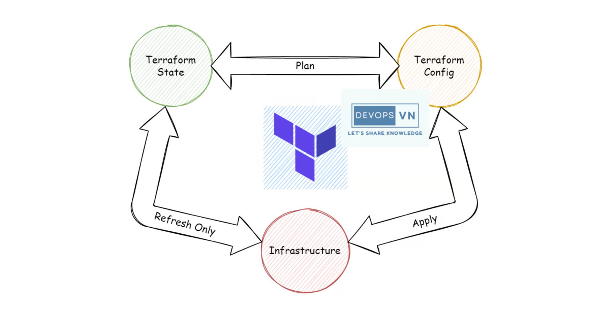
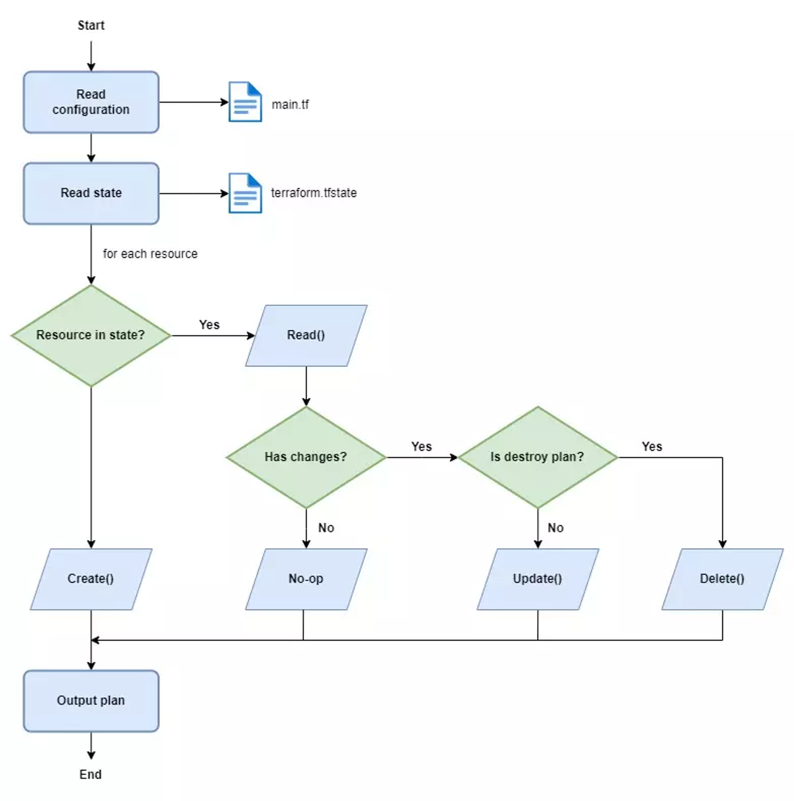

This repository is an IaC tool used for provisioning and managing infrastructure.
- Terraform is created by HashiCorp.

- Overview:

  

- Lifecycle:

  

## Table of Contents

- [Getting Started](#getting-started)
- [Terraform Concepts](#terraform-concepts)
- [Best Practices](#best-practices)
- [Further Resources](#further-resources)
- [Example](#example)

## Getting Started

Define IaC using HashiCorp Configuration Language (HCL) or JSON

1. [Install Terraform](https://www.terraform.io/downloads.html)

2. Create a `main.tf` file to define your infrastructure.

3. [Configure Provider](https://registry.terraform.io/browse/providers): Select the cloud provider or platform

4. [Write Code](): Using Terraform's HCL or JSON syntax.

5. [Initialize and Apply](): Run `terraform init` and `terraform apply` to create and provision infrastructure.

## Terraform Concepts

- [Terraform Configuration Language](https://www.terraform.io/docs/language/index.html)
- [Providers](https://www.terraform.io/docs/providers/index.html)
- [Resources](https://www.terraform.io/docs/configuration/resources.html)
- [Variables](https://www.terraform.io/docs/configuration/variables.html)
- [Outputs](https://www.terraform.io/docs/configuration/outputs.html)

## Best Practices

- [Terraform Best Practices](https://www.terraform.io/docs/best-practices/index.html)

## Further Resources

- [Terraform Learning](https://devopsvn.tech/terraform-series/terraform)
- [Terraform Registry](https://registry.terraform.io/): Explore and find community-contributed Terraform modules and provider documentation.
- [Terraform GitHub](https://github.com/hashicorp/terraform): The Terraform GitHub repository contains the source code and allows you to file issues or contribute to the project.

## Example

- Use folder `ec2`
- Run `terraform init` -> `terraform plan` -> `terraform apply`
- Run with variable: `terraform apply -var-file="<path-to-file>"`
  Example `terraform apply -var-file="production.tfvars"` (get defined variables in `variable.tf`)

Happy Terraforming! 🚀
